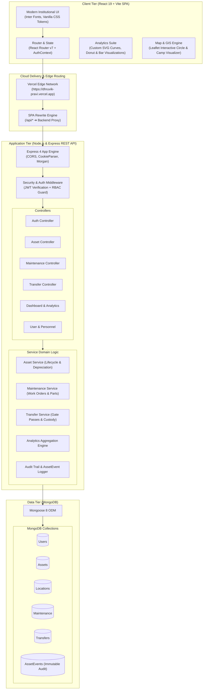
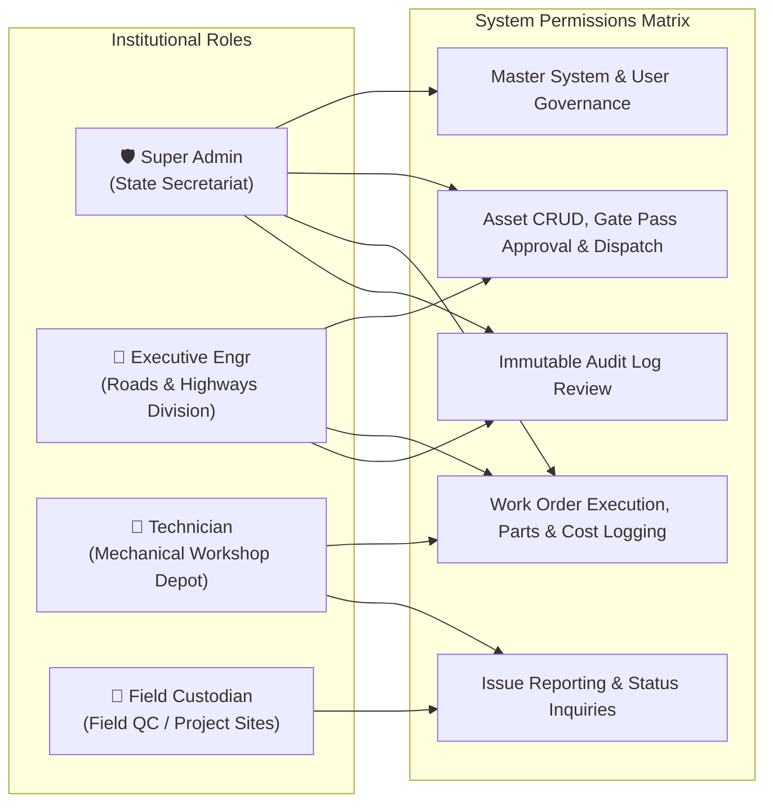
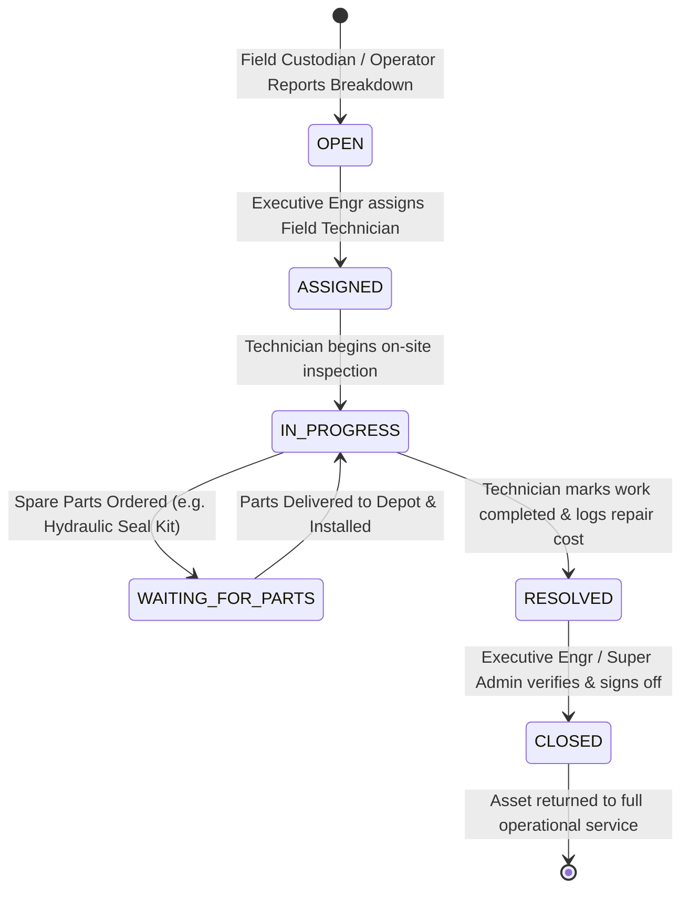
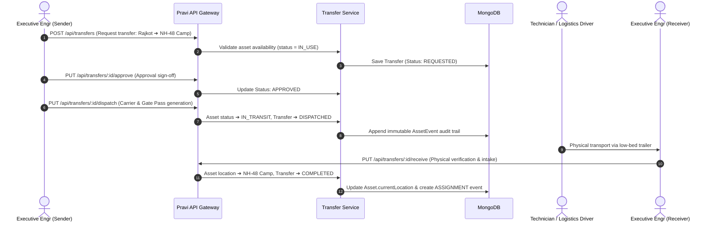

# Pravi (પ્રવિ) — Infrastructure Asset Lifecycle Management Architecture

## 1. High-Level System Architecture

---

## 2. Role-Based Access Control (RBAC) Architecture

---

## 3. Work Order & Maintenance Lifecycle Flow

---

## 4. Gate Pass & Inter-Site Custody Transfer Workflow

