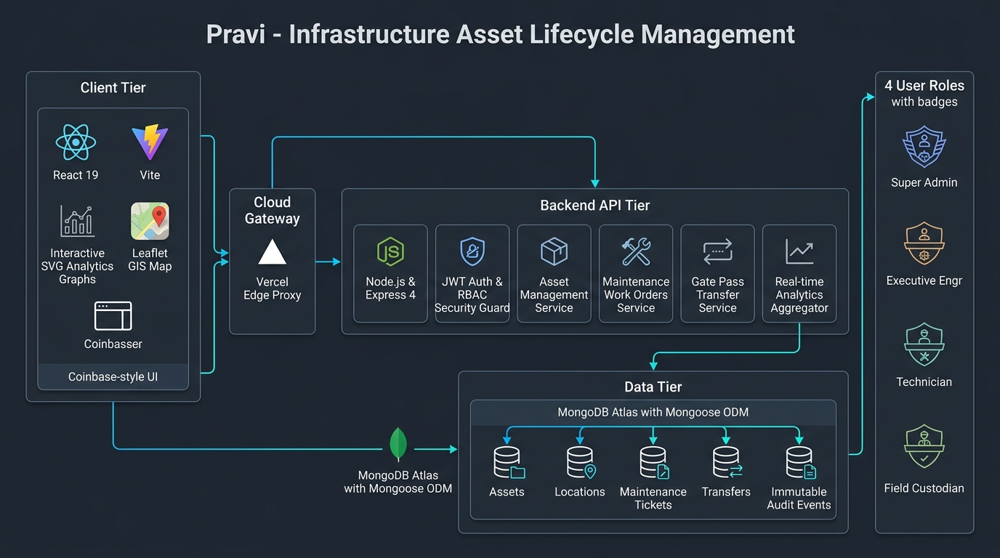

# Pravi (પ્રવિ) — Infrastructure Asset Lifecycle Management

[](https://dhruvik-pravi.vercel.app)
[](https://nodejs.org/)
[](https://react.dev/)
[](https://vitejs.dev/)
[](https://www.mongodb.com/)
[](https://opensource.org/licenses/MIT)

**Pravi** is a unified, enterprise-grade Infrastructure Asset Lifecycle Management portal developed for **Roads & Buildings (R&B)** departments, municipal corporations, and heavy civil construction projects. 

It provides real-time custody tracking, inter-site gate pass logistics, breakdown repair lifecycles, and multi-dimensional financial expenditure analytics across state infrastructure machinery, vehicles, and testing apparatus.

---

## 🏛️ System Architecture



The application follows a clean, decoupled 3-tier enterprise architecture:
1. **Client Tier (Presentation)**: Built on React 19 and Vite with an institutional design system, vector SVG analytical charts, Leaflet GIS mapping, and responsive role guards.
2. **Cloud Gateway & API Tier (Application Logic)**: Powered by Node.js & Express 4 featuring JWT session security, strict Role-Based Access Control (RBAC), multi-officer transfer validations, and database aggregation pipelines.
3. **Data Tier (Persistence)**: MongoDB with Mongoose ODM modeling physical assets, geospatial divisions, work order lifecycles, and an immutable event audit trail.

---

## ✨ Key Features

### 1. 📊 Interactive Analytics & Data Distribution Suite
- **Monthly Expenditure & Work Volume Trend Curve**: Dual-metric SVG spline tracking 6-month maintenance expenses alongside ticket volumes with interactive hover tooltips and KPI run-rate summaries.
- **Capital Valuation Donut**: Proportional visual distribution of the ₹7.54 Crore statewide capital asset portfolio across Heavy Machinery, Transport Fleet, Civil & HVAC, and Survey Instruments.
- **Fleet Operational Health & Readiness Index**: Weighted readiness score calculating real-time availability across *Brand New*, *Good*, *Fair*, *Needs Repair*, and *Damaged* equipment.
- **Divisional Site Deployment Density**: Geographic allocation bars tracking machinery placement across state circle headquarters and active highway project camps.

### 2. 🛡️ Role-Based Access Control (RBAC)
Four standardized roles with tailored security clearances and capabilities:
- 🛡️ **Super Admin** (`admin@pravi.gov.in`): Complete system governance, master configuration, user onboarding, and system-wide audits.
- 👷 **Executive Engr** (`manager@pravi.gov.in`): High-level operational authority, asset transfer authorizations, gate pass dispatch, and work order closure sign-off.
- 🔧 **Technician** (`tech@pravi.gov.in`): Mechanical work order execution, parts replacement logging, repair diagnostics, and resolution marking.
- 👤 **Field Custodian** (`employee@pravi.gov.in`): On-site issue reporting, breakdown alerts, and work order status tracking.

### 3. ⚙️ Complete Maintenance & Work Order Pipeline
- Multi-stage lifecycle state machine: `OPEN` ➔ `ASSIGNED` ➔ `IN_PROGRESS` ➔ `WAITING_FOR_PARTS` ➔ `RESOLVED` ➔ `CLOSED`.
- Dynamic spare parts inventory tracking with automated repair cost recalculation.
- Real-time communication feed between site custodians, executive engineers, and field technicians with role-coded message tags.

### 4. 🚚 Inter-Site Gate Passes & Custody Transfers
- Multi-officer authorization workflow preventing unauthorized asset displacement.
- Gate pass generation recording logistics carriers, vehicle plate numbers, driver contacts, and low-bed trailer safety checklists.
- End-to-end status flow: `REQUESTED` ➔ `APPROVED` ➔ `DISPATCHED` ➔ `COMPLETED`.

### 5. 🗺️ GIS Mapping & Geospatial Visualizer
- Interactive Leaflet-powered GIS engine mapping circles, central workshops, and active highway widening camps across Gujarat.
- Site asset capacity metrics and drill-down equipment inventories.

### 6. 📜 Immutable Audit Trails
- Append-only `AssetEvent` logging capturing every custody change, dispatch, maintenance resolution, and condition assessment with officer timestamps.

---

## 👥 Demo Logins

Click any of the **Demo Accounts** buttons on the login screen to sign in with pre-configured credentials:

| Role Badge | Designation | Demo Email | Password | Access Scope |
| :--- | :--- | :--- | :--- | :--- |
| 🛡️ **Super Admin** | State Secretariat | `admin@pravi.gov.in` | `Admin@123456` | Master system & personnel control |
| 👷 **Executive Engr** | Roads & Highways Div | `manager@pravi.gov.in` | `Admin@123456` | Gate passes, work orders & closures |
| 🔧 **Technician** | Mechanical Workshop | `tech@pravi.gov.in` | `Admin@123456` | Maintenance execution & parts logging |
| 👤 **Field Custodian** | Quality Control & Site | `employee@pravi.gov.in` | `Admin@123456` | Breakdown reporting & status tracking |

---

## 🛠️ Technology Stack

| Layer | Technologies |
| :--- | :--- |
| **Frontend** | React 19, Vite, React Router v7, Leaflet (GIS), Lucide Icons, Vanilla CSS |
| **Backend** | Node.js (v20+ / v22+), Express 4, Mongoose 8, JWT, bcryptjs, Morgan |
| **Database** | MongoDB Atlas / Local MongoDB replica |
| **Cloud Deployment** | Vercel (Edge CDN & Client) + Render / Railway (API Service) |
| **Architecture** | REST API, Single-Page Application (SPA), Unified Production Server |

---

## 🚀 Quick Start & Local Setup

### Prerequisites
- [Node.js](https://nodejs.org/) (v18 or higher)
- [MongoDB](https://www.mongodb.com/) (running locally or MongoDB Atlas connection string)

### 1. Clone Repository
```bash
git clone https://github.com/dhruvikparmar26-hub/pravi_research.git
cd pravi_research
```

### 2. Configure Environment Variables
Create a `.env` file in the `server` directory:
```env
PORT=5000
NODE_ENV=development
MONGO_URI=mongodb://localhost:27017/pravi
JWT_SECRET=pravi_secure_secret_key_2026
JWT_EXPIRE=7d
JWT_COOKIE_EXPIRE=7
CLIENT_URL=http://localhost:5173
```

### 3. Install Dependencies
```bash
# Install root dependencies
npm install

# Install server dependencies
cd server
npm install

# Install client dependencies
cd ../client
npm install
cd ..
```

### 4. Seed Initial Data
Populate the database with assets, locations, users, and maintenance tickets:
```bash
cd server
npm run seed
cd ..
```

### 5. Start Development Servers
Run the client and backend simultaneously:
```bash
# In the root directory:
npm run dev
```
- Client runs at: `http://localhost:5173` (or `http://localhost:3000`)
- Backend runs at: `http://localhost:5000`

---

## 📦 Production Build & Unified Server

To build the client and serve everything from a single high-performance Express server:
```bash
# 1. Build client bundle
cd client
npm run build
cd ..

# 2. Start unified production server
cd server
npm start
```
Open **`http://localhost:5000`** in your browser to access the complete application.

For detailed cloud deployment instructions (Vercel, Render, MongoDB Atlas), refer to **[DEPLOYMENT.md](./DEPLOYMENT.md)**.

---

## 📄 License
This project is licensed under the [MIT License](./LICENSE).

---

## 👨‍💻 Author
**DHRUVIKSINH PARMAR**  
GitHub: [@dhruvikparmar26-hub](https://github.com/dhruvikparmar26-hub)  
Repository: [dhruvikparmar26-hub/pravi_research](https://github.com/dhruvikparmar26-hub/pravi_research)
